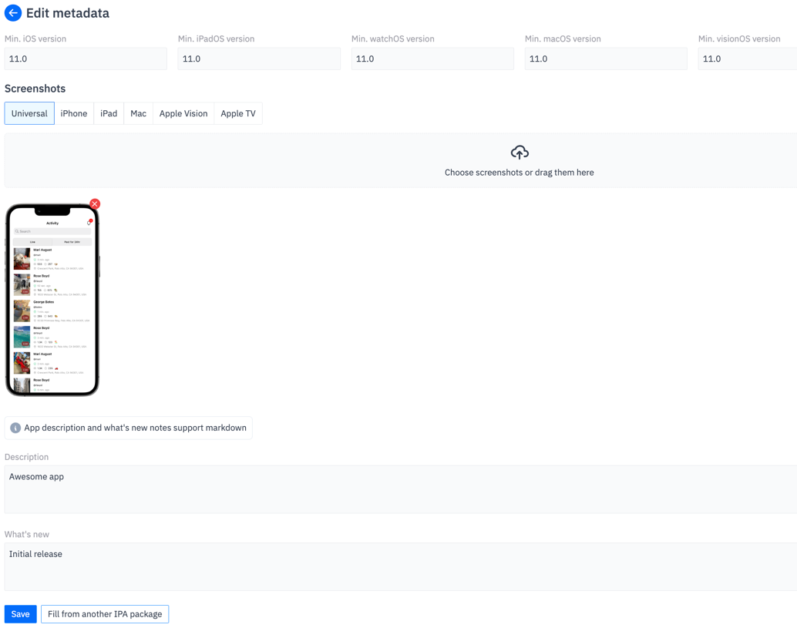
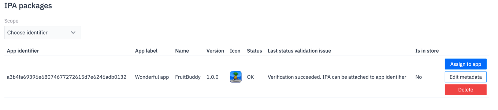
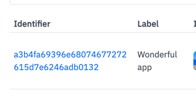

# App publication journey for officially recognised developer

Hello, developer!

If you have decided to use appdb to publish your app independently, here is how to do it:

## Registration on the Platform

appdb treats developer and customer security and privacy at highest level. We are sure that a trust chain needs to be established between
developer and end customer, and appdb helps to do it.

### Account creation
Start by creating a Publisher ID account in [appdb Publisher area](https://publisherid.appdb.to/auth).

Please fill your information carefully, as it is required for mandatory identity verification on next step. Do not use Apple-provided email address, as Apple is
known to be blocking emails from us without any notices.

New account with temporary password will be created for you; and password will be sent to your email address.

### Logging in

[Login](https://publisherid.appdb.to/auth) with your temporary password.

### Enabling strong authentication

To enhance security of your account, two-factor authentication must be enabled. We allow developers to authenticate themselves with time based codes - 
it is an industry standard. Use any authenticator app like [Google Authenticator](https://apps.apple.com/us/app/google-authenticator/id388497605) to scan QR code
and get time-based code.

Click "Continue".

Confirm your second authentication factor by entering code that was generated in your authenticator app.

Now your account is secure. You will be redirected to your publisher ID overview page. This information may be filled automatically during your identity verification.

> We encourage you to change your temporary password to another one by visiting [password change page](https://publisherid.appdb.to/change-password).

## Verifying your identity

Very important part of trust chain establishment is your identity verification. Please head over to identity verification by clicking on [Verify Identity](https://publisherid.appdb.to/verify-identity)
and provide your government-issued IDs.

**You can not publish apps on appdb officially without mandatory identity verification!**

While your identity is being verified, you can head over to [Publisher Area](https://publisher.appdb.to/) by clicking on appropriate link in left navigation panel.

## App publication

### Filling trade name information (legal entity)

After you navigated to Publisher Area service, you need to add information about your legal entity.

At the moment appdb supports these types of legal entities:

1) Physical person (you personally)
2) Company
3) Non-profit organization
4) Government institution

> While Publisher ID ensures that you are real person, filling of legal entity information sets your trading name on the Platform.

Fill in your legal entity information and click "Save".

After you have saved legal entity information, please attach supporting documents that prove your rights to act on behalf of legal entity; provide proof of residence or/and registered address.

**Your trade name information will be submitted to verification by the Platform support team. Usually it takes less than a day.**

> Without legal entity verification your apps won't be listed in store, but you can test them and prepare everything for the release.

### Creating an app identifier

appdb app identifiers are unique alphanumeric strings. appdb assings randomly generated app identifier when you create it.

app identifiers define scope of appdb services, APIs usage, pricing and licensing models, customer and device data tokenization and other various parameters.

appdb app identifiers **are not** Apple bundle identifiers, as, due to nature of system design by Apple Inc, bundle identifier is considered as variable in
our systems and does not change or modifies anything. Everything is your app is relative to its path and to its assigned bundle identifier. Current assigned Apple bundle identifier will be provided to you via [appdb services SDK](https://github.com/appdb-official/AppdbSDK)

Click [Identifiers](https://publisher.appdb.to/apps/identifiers) to visit identifiers screen and then click [Create app identifier](https://publisher.appdb.to/apps/identifiers/manage/new).

Fill in required information. If you have doubts, click "?" symbols or read [appdb Services and Features documentation](/services-and-features/overview).

Click continue.

You will be redirected to app identifiers screen, where you can see that your app identifier is pending verification.

### Signing of required agreements for legal compliance

And something other has happened as well. For legal compliance, you need to sign required agreements.

By clicking on the row, you can open and read required agreement, scroll down to sign it.

Please enter:
1) Signatory name that you entered when you [filled your legal entity information](/developer-apps-publishing/journey?id=filling-trade-name-information-legal-entity)
2) Time-based code from your authenticator app that [you configured earlier](/developer-apps-publishing/journey?id=enabling-strong-authentication)

Tap "Sign".

> appdb will queue your app identifier for verification again, you dont need to do this manually

Most likely your app will end in "App identifier is missing assigned IPA" status. Now you need to upload your IPA package to assign it to your app identifier.

### Uploading of IPA package

Each App identifier should have an attached IPA package (binaries bundle). It is version of your app to be released.

To upload it to appdb, click "Upload IPA package" button.

IPA package upload form will reveal:

> Until Apple Inc is still man-in-the-middle, gatekeeping code signing and breaking digital chain of trust between you and your end customer; until they have not fulfilled our interoperability request to support code signing certificates of real developers issued by trusted CAs (not just their own CA) and physical keys and Hardware Security Modules, you don't need to sign your IPA package at all, or sign it with adhoc signing identity "-". appdb manages signing automatically on customer level.

To build your app use [appdb build and sign tools](https://github.com/appdb-official/appdb-build-tools), it will produce IPA file that is ready to be sent to appdb.

> appdb does not support IPA build numbers. To upload new IPA file, increment its version number.

Once your IPA package was uploaded, it should pass initial validation and checks against known malware functions.
If checks are succeeded, you will be presented with successful validation message (or error otherwise):

Then you need to edit metadata of your IPA file. Click "edit metadata" button. Fill appropriate fields, or you can use "Fill from another IPA package" button to copy information from one your previous releases.

### Editing of IPA metadata

Notes:
1) Please resize and optimize your screenshots prior to uploading. appdb does not resize them.
2) If it is the first release of an app, enter "Initial release" in "What's new" section of the form.

> Please note that automatic detection of minimum operating system support and parsing of app icon may fail due to
> different formats of IPA packages in more than 15 years of history. In this case, please [create ticket in support desk](https://aysa-support.freshdesk.com/), so we can adjust our systems to detect these values from your IPAs.

After you edited IPA metadata, it will be verified once again for consistency. If everything is normal, IPA should result in "OK" status, so it can be assigned to an app.

### Assigning IPA to app identifier

Now you are ready to assign your IPA to your app and start testing
(if you've set publication date in the future when you [created or edited your app identifier](/developer-apps-publishing/journey?id=creating-app-identifier)).

Click "Assign to App" to assign IPA to your app identifier.

Now you can start test of your app deployment and functions, even if it is not listed in the store and failing legal compliance or any other checks.

## Testing your app deployment

While app is not listed in the store, you can [configure testing devices and attach failure domains to them](/app-development/testing-with-failure-domains).
If app is already listed, these devices can be used to test newer version of your app.

## App installation

App installation is the same as normal usage of appdb by regular customer.

To install an app, [link your device to appdb](https://appdb.to/link).

[Video tutorial - device linking](https://www.youtube.com/embed/LWy51S2piqE?si=8nbIg80hhLWSg3Gj ':include :type=iframe')

Then, till interoperability will be implemented by Apple, [link your Apple developer account](https://appdb.to/my/apple) to be able to install apps.

[Video tutorial - developer account linking](https://www.youtube.com/embed/-ShhaoaLWyE?si=mhgSFzf8EHP3y0X- ':include :type=iframe')

Then, visit your app page by clicking on your app identifier in Publisher Area.

Check that your app description page looks good, if necessary, edit IPA metadata or app identifier metadata.

Then, tap "Install" button.

App installation will be queued to your device. If something is wrong, you can always check [device status page](https://appdb.to/my/status) or [troubleshoot it](/troubleshooting/app-installations).

Once your device is added to test devices, you can attach debugger to your app. If it is not listed, then you can not.

## Release your app

Once you have completed all your tests, you need to fix all remaining issues that were found by the system and listed on your [app identifiers screen](https://publisher.appdb.to/apps/identifiers).

> Once all issues are fixed, your app status will become "OK, listed in Store" and it will be available for everyone

Woah, it was a big journey.

Last edited 15 Jul 2024.
