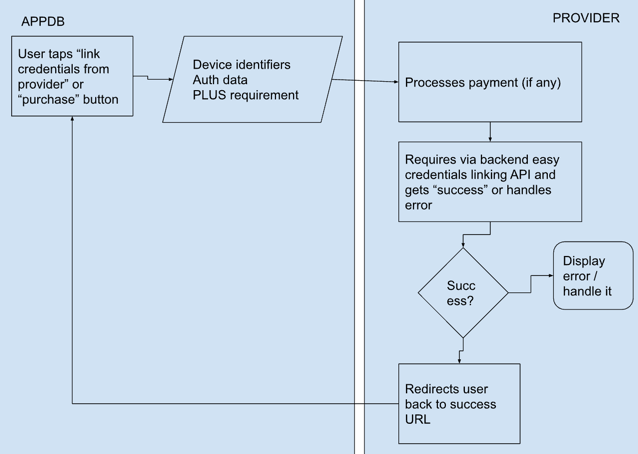

# Easy certificate linking to appdb

Until Apple Inc allows developers to sign apps by themselves without limitations or/and until our interoperability request will be fulfilled, we offer apple developer certificate providers to implement
easy linking of certificates to appdb.

## Preparation

1. Create [appdb publisher ID](https://publisherid.appdb.to/auth?authAppID=staff_area).
2. Navigate to appdb+certificate program and integration panel in [appdb staff area](https://a.appdb.to/acp.php?action=pluscerts).
3. Create a website, fill in required details, then proceed to integration itself and testing.

## Integration flow



## Credentials linking process

Upon user tapping on easy credentials linking button, he will be redirected to providers URL with these GET parameters:

1. ```udid``` (string) - device UDID.
2. ```model```  (string) - device model identifier (e.g. iPhone 10,4).
3. ```email``` (string) - user email.
4. ```at``` (string) - parameter (encrypted action ticket for appdb API).
5. ```returnto``` (string) - to return user to this URL after flow is complete.
6. ```is_plus``` (int) - does PLUS activation required by user or not (1 if yes, 0 if not).

Then credential provider must request ***[configure](https://api.dbservices.to/v1.7/spec/#/partner/post_configure_)*** API method with defined parameters.

Upon receiving success, redirect user back to ***returnto***.

## Listing on frontpage

If you want to sell appdb+certificate bundles and your website to be listed on the [installation method configuration manual frontpage](https://appdb.to/my/buy), after you have completed all tests, click on “Activate front page” and buy PLUS activations. After this, we will enable your website on the front page. You need to top-up PLUS activations from time to time to be continued to be listed on the front page.

If you do not want to do this, this is totally fine, then you can do your own business and be listed on [device features configuration page](https://appdb.to/my/configure), without any limitations or payments, so you users can enjoy access to app installations from appdb.

## Code sample

```php
<?php

/*
 * GET YOUR ID AND SECRET FROM https://a.appdb.to/acp.php?action=pluscerts
 */
$DEV_CREDENTIALS_PROVIDER_ID = 'FILL_IN';
$DEV_CREDENTIALS_PROVIDER_SECRET = 'FILL_IN';

/**
 * CURL wrapper
 * @param $url string URL to request
 * @param $post_data array of POST data
 * @return bool|string Plaintext result of request
 */
function curl_request($url, $post_data = array())
{
    $ch = curl_init();
    curl_setopt($ch, CURLOPT_URL, $url);
    curl_setopt($ch, CURLOPT_RETURNTRANSFER, 1);
    curl_setopt($ch, CURLOPT_CONNECTTIMEOUT, 3);
    curl_setopt($ch, CURLOPT_SSL_VERIFYPEER, false);
    curl_setopt($ch, CURLOPT_SSL_VERIFYHOST, false);
    curl_setopt($ch, CURLOPT_FOLLOWLOCATION, true);
    //curl_setopt($ch,CURLOPT_VERBOSE,true);
    if ($post_data) {
        $post_data = http_build_query($post_data, '', '&');

        curl_setopt($ch, CURLOPT_POSTFIELDS, $post_data);
    }
    curl_setopt($ch, CURLOPT_TIMEOUT, 180);
    return curl_exec($ch);
}

/**
 * Requests appdb API
 * @param $method string method
 * @param $data array data to be passed
 * @return mixed false|object API response
 */
function api_request($method, $data = [])
{
    $API_URL = "https://api.dbservices.to/v1.7/{$method}/";
    return json_decode(curl_request($API_URL, $data));
}

/*
 * Checks for parameters
 */

$at = (string)$_REQUEST['at'];
$returnto = (string)$_REQUEST['returnto'];
$udid = (string)$_REQUEST['udid'];
$is_plus = (int)$_REQUEST['is_plus'];

if (!$at || !$returnto || !$udid) {
    die('Invalid request from appdb');
}

/*
 * Preparing array to be passed to appdb API request
 */
$to_request['at'] = $at;
/*
 * WRITE HERE LOGIC TO CHECK THAT UDID EXISTS IN YOUR DATABASE, GET CERTIFICATES AND PROVISIONS FOR THIS UDID
 * THEN ADJUST FILES OR ADD YOUR LOGIC
 */

$order_id = 'GET_ORDER_ID_FROM_DATABASE';
$order_timestamp = 'GET_ORDER_UNIX_TIMESTAMP_FROM_DATABASE';

$to_request['params']['p12'] = base64_encode(file_get_contents('p12.p12')); // P12 file
$to_request['params']['p12_password'] = 'qwerty'; // P12 password
$to_request['params']['provision'] = base64_encode(file_get_contents('explicit.mobileprovision')); // Explicit bundle id mobile provisioning profile
$to_request['params']['wildcard_provision'] = base64_encode(file_get_contents('wildcard.mobileprovision')); // Explicit bundle id mobile provisioning profile

$to_request['params']['dev_p12'] = base64_encode(file_get_contents('p12.p12')); // development P12 file
$to_request['params']['dev_p12_password'] = 'qwerty'; // development P12 password
$to_request['params']['dev_provision'] = base64_encode(file_get_contents('dev_explicit.mobileprovision')); // Explicit bundle id mobile provisioning profile with development certificate
$to_request['params']['dev_wildcard_provision'] = base64_encode(file_get_contents('dev_wildcard.mobileprovision')); // Explicit bundle id mobile provisioning profile with development certificate

if ($is_plus) {
    $to_request['dev_credential_provider_id'] = $DEV_CREDENTIALS_PROVIDER_ID;
    $to_request['plus_activated_at'] = $order_timestamp;
    $to_request['plus_transaction_id'] = $order_id;
    $to_request['plus_hash'] = sha1("{$to_request['plus_transaction_id']}{$to_request['plus_activated_at']}{$DEV_CREDENTIALS_PROVIDER_SECRET}");
}
/*
 * Making request to appdb's configure method
 */
$appdb_response = api_request('configure', $to_request);

/*
 * checking for network error or unexpected response
 */
if (!$appdb_response) {
    die('appdb did not respond');
}
/*
 * checking for correct response, but other errors
 */
if (!$appdb_response->success) {
    die("Error from appdb API: " . $appdb_response->errors[0]->translated);
}
/*
 * redirecting back to appdb
 */
header("Location: {$returnto}");
```
Last updated 14 May 2024.
